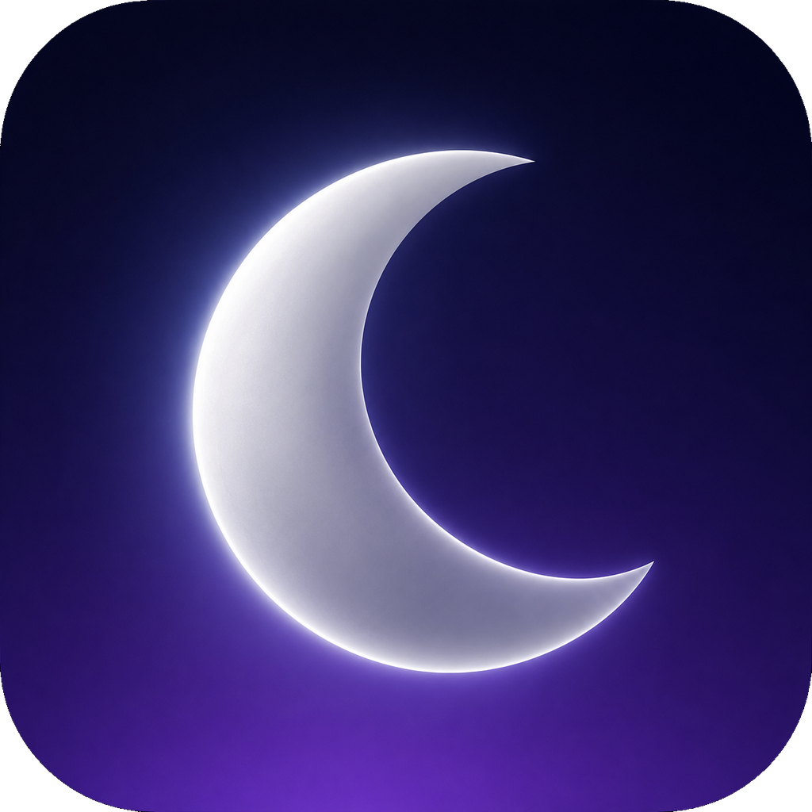

    
    <h1>kaguya</h1>
    

        The Chromium-based web browser made for people, with love.
         
        Privacy-first with unbiased ad-blocking. No bloat and no noise.
    

    <a href="https://github.com/iceice666/kaguya-macos">
        github.com/iceice666/kaguya-macos
    </a>

## Downloads
> [!NOTE]
> kaguya is currently in beta, so unexpected issues may occur.
> Please report them if they haven't already been reported.

The easiest way to download kaguya is from the GitHub releases for macOS.

This project currently ships a macOS version only. Linux and Windows packages
are not maintained for kaguya at this time.

- [Latest macOS release](https://github.com/iceice666/kaguya-macos/releases/latest)

## kaguya repos
All kaguya packaging, tooling, services, and components are open source
and published on GitHub.

### Platform packaging and tooling
- [kaguya for macOS](https://github.com/iceice666/kaguya-macos)

### Web services and kaguya components
- [kaguya services](https://github.com/iceice666/kaguya-services)
- [kaguya onboarding](https://github.com/iceice666/kaguya-onboarding)
- [kaguya fork of uBlock Origin](https://github.com/imputnet/uBlock)

## Development
macOS is the supported development platform for community contributions.

[> See development docs in macOS repo](https://github.com/iceice666/kaguya-macos/blob/main/docs/building.md#development-build-and-environment)

## Contributing
Before contributing to kaguya, please read the guidelines in
[CONTRIBUTING.md](CONTRIBUTING.md).

## Credits

### Helium Browser
kaguya is a rebrand and downstream fork of
[Helium Browser](https://github.com/imputnet/helium). Helium-authored files,
patches, and license notices remain attributed to the Helium project.

### The Chromium project
[The Chromium Project](https://www.chromium.org/) is at the core of kaguya,
making it possible in the first place.

### ungoogled-chromium
This repo is based on [ungoogled-chromium](https://github.com/ungoogled-software/ungoogled-chromium),
but heavily modified for kaguya. Special thanks to everyone behind ungoogled-chromium,
they made working with Chromium way easier.

### Other Chromium browsers

kaguya includes some patches from other open source Chromium browsers:

- [Inox patchset](https://github.com/gcarq/inox-patchset)
- [Debian](https://tracker.debian.org/pkg/chromium-browser)
- [Bromite](https://github.com/bromite/bromite)
- [Iridium Browser](https://iridiumbrowser.de/)
- [Brave](https://github.com/brave/brave-core)

All patches are sorted by vendor in the [patches](patches/) directory of this repo.

## License
All code, patches, modified portions of imported code or patches, and
any other content that is unique to kaguya and not imported from other
repositories is licensed under GPL-3.0. See [LICENSE](LICENSE).

Any content imported from Helium, ungoogled-chromium, Chromium, or other
upstream projects retains its original license and copyright notices. For
example, original unmodified code imported from ungoogled-chromium remains
licensed under their [BSD 3-Clause license](LICENSE.ungoogled_chromium).
